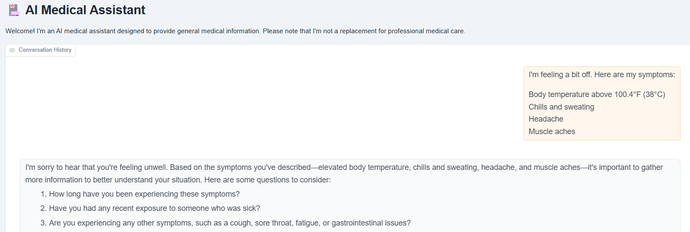

# Health-bot

A health chatbot that assists users with:
- Medical information
- Symptom checking
- Appointment scheduling
- Medication reminders
- Mental health support
- Personalized health tips
- 24/7 access to health resources

## Setup Instructions

Follow these steps to set up the Health-bot on your local machine:

### Step 1: Clone the Repository
```bash
git clone https://github.com/ramyavarma123/Health-bot.git
```

### Step 2: Navigate to the Project Directory
```bash
cd Health-bot
```

### Step 3: Install Dependencies
```bash
pip install -r requirements.txt
```

### Step 4: Start the Application
After installation, open your browser and navigate to:
```
http://127.0.0.1:7860
```

You can now start interacting with Health-bot.

## Demo Image

```

